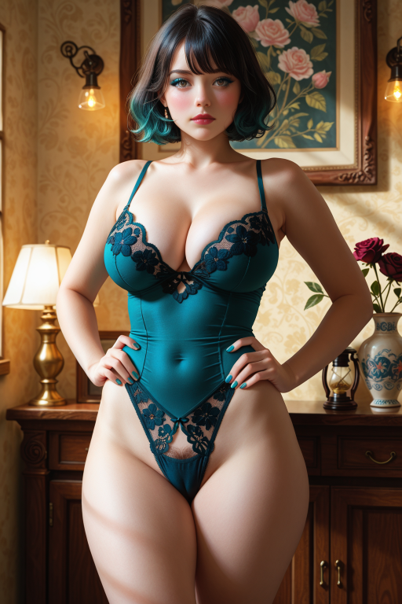

# ComfyUI Violet Tools 💅

[](CHANGELOG.md)

A collection of aesthetic-focused custom nodes for ComfyUI that enhance AI image generation with sophisticated style and prompt management capabilities. These nodes provide curated aesthetic options, quality controls, persona-preserving workflows, and prompt enhancement tools designed for creating high-quality, stylistically consistent AI-generated images.

## Features

### 🧹 Automatic Prompt Deduplication (New in 2.2.1)

All Violet Tools prompt nodes now include intelligent deduplication to handle repetitive outputs from T5 models and other dynamic prompt sources:

- **Phrase-Level Deduplication**: Removes duplicate comma-separated phrases while preserving order
  - Example: `"mystical landscape, mystical landscape, mystical landscape"` → `"mystical landscape"`
  - Only deduplicates exact matches—different phrases with the same words are preserved
  - `"purple hair, purple fingernails"` → both kept (doesn't remove "purple" from either)
- **Comma Cleanup**: Fixes malformed comma sequences automatically
  - `"text,, more text"` → `"text, more text"`
  - Normalizes spacing around commas
- **Case-Sensitive**: Treats `"Film Grain"`, `"film grain"`, and `"film_grain"` as different phrases
- **Zero Configuration**: Works automatically on all prompt outputs—no setup needed

This feature dramatically improves prompt quality when using less sophisticated text encoders that tend to repeat phrases, reducing a typical clumsy T5 output from 36 phrases to 23 unique phrases.

### 🧬 Encoding Enchantress

Advanced text encoding and prompt processing node for enhanced prompt interpretation with comprehensive token analysis:

- Four encoding modes: closeup, portrait, smooth blend, and compete combine
- Individual strength controls for different prompt elements
- Optional manual override: accepts a single override string from 🔮 Oracle's Override; when present, it becomes the entire positive prompt
- Optional prompt optimization: the Essence Algorithm reduces redundant tokens and canonicalizes aliases to maximize attention on key concepts
  - Purely algorithmic (no LLM); positive-only (quality, scene, glamour, body, aesthetic, pose)
  - Disabled automatically when 🔮 Oracle's Override is used
  - When `token_report` is on, adds a “🪙 Token Savings” summary with before→after counts
- **Token Report System**: Detailed analysis of token usage per Violet Tools node
  - Shows 77-token chunk breakdown for each prompt component
  - SDXL support with merged stream analysis
  - Optional reporting to avoid performance impact when disabled

### 👑 Quality Queen

Generates quality prompts with boilerplate tags and customizable style options. Includes:

- Boilerplate quality tags for consistent high-quality outputs
- Multiple predefined style options
- Custom text integration

### 💃 Body Bard

Specialized node for body feature and pose description generation with detailed anatomical and postural options.

### ✨ Glamour Goddess

Hair and makeup styling node that creates detailed aesthetic descriptions:

- Modular hair styling options
- Comprehensive makeup choices
- Randomization and manual selection modes

### 💋 Aesthetic Alchemist

Style blending system that combines multiple aesthetic approaches:

- 20+ curated aesthetic styles (Gothic Glam, Cyberpunk, Cottagecore, Y2K, etc.)
- Weighted blending of multiple aesthetics
- Strength control for fine-tuning style intensity

### 🤩 Pose Priestess

Pose and positioning control node with separate categories for different content types:

- **General Poses**: Wide variety of artistic and portrait poses
- **Spicy Poses**: Adult/erotic poses for mature content creation
- Arm gesture combinations for enhanced expressiveness
- Weighted blending with strength controls
- Random selection from each category

### 🚫 Negativity Nullifier

Negative prompt management system with smart defaults and customizable exclusions.

### 🧜‍♀️ Save Siren

Advanced image saving utility that creates A1111-format metadata for maximum compatibility with stable diffusion websites and upload services:

- A1111-compatible parameter format with embedded LoRA tags and proper hash formatting
- Automatic model and LoRA detection from workflow with Civitai filename resolution
- Compact metadata embedding with both JSON and A1111 formats
- Perfect compatibility with image uploaders and sharing platforms across the stable diffusion ecosystem

### 🪪 Character System (Wireless)

Save, load, and manage consistent character traits via UI — no canvas wiring required:

- 💖 Character Curator: single node for Save, Load to All, and Delete actions (buttons in the node UI)
- Autocomplete + Browse overlay for quickly selecting or overwriting character names
- REST endpoints power the UI: GET/POST/DELETE /violet/character
- Saved as versioned JSON (silent migration preserved); stored under `ComfyUI/user/default/comfyui-violet-tools/characters`

Note: Legacy Character Creator/Cache nodes have been removed in 2.x. Existing characters continue to work.

## 🪄 Wildcard Extras

All prompt nodes include an "extra" multiline field that supports lightweight wildcard syntax: write alternatives inside braces and separate with pipes, for example {soft light|rim lighting|studio glow}. One option is chosen per block on each run, and nested blocks are resolved safely. This is available on: Quality Queen, Scene Seductress, Glamour Goddess, Body Bard, Aesthetic Alchemist, Pose Priestess, and Negativity Nullifier.

Additionally, 🔮 Oracle's Override supports wildcards in both its `chain` and `override` fields, resolved repeatedly until stable so nested and cascaded choices work as expected.

## 🎨 Color Chips UI Enhancement (Updated in 1.4.x)

Revolutionary visual color selection interface that transforms tedious dropdown navigation into an intuitive, visual experience:

- **Visual Color Swatches**: See exactly what "cyan-teal" or "rose-red" looks like with 20×20px color chips
- **18 Color Fields Enhanced**: All hair colors, makeup colors, eye colors, nail colors, and skin tones
- **60+ Colors Per Field**: Complete spectrum coverage with light/dark variants
- **Instant Search**: Type to filter colors by name (search "teal", "red", "dark", etc.)
- **Smart Tooltips**: Hover to see color names and hex values
- **One-Click Selection**: Click any color chip to instantly set the dropdown value
- **Zero Breaking Changes**: Existing workflows continue working perfectly
- **Performance Optimized**: Only loads for Violet Tools nodes with color fields

**Supported Color Fields:**

- **Glamour Goddess**: hair_color, highlight_color, hair_tips_color, eye_color, eyeliner_color, blush_color, eyeshadow_color, lipstick_color, brow_color, fingernail_color, toenail_color
- **Body Bard**: skin_tone, areola_shade, pubic_hair_color, armpit_hair_color

The color chips automatically appear below color dropdown widgets in supported nodes (now with streamlined single JS implementation), providing immediate visual feedback and dramatically faster color selection. No more scrolling through 60+ options to find the perfect shade!

## Supported Aesthetic Styles

The Aesthetic Alchemist includes carefully curated definitions for:

- **Alt Fashion** - Eclectic, bold, and expressive alternative styles
- **Athleisure** - Sporty chic and comfortable athletic wear
- **Cottagecore** - Pastoral, vintage, and nature-inspired aesthetics
- **Cyberpunk** - Futuristic neon and dystopian tech aesthetics
- **Dark Academia** - Scholarly, vintage, and intellectually rich vibes
- **E-girl** - Bold makeup, vibrant colors, and edgy digital culture
- **Fairycore** - Whimsical, magical, and nature-inspired elements
- **Gothic Glam** - Dark luxury with dramatic and mysterious elements
- **Grunge** - Rebellious, distressed, and urban decay aesthetics
- **Nu-Goth** - Modern gothic with urban and alternative influences
- **Y2K** - Nostalgic early 2000s fashion and metallic accents
- And many more...

## Installation

1. Clone the repository into your ComfyUI `custom_nodes` directory:

  ```bash
  cd ComfyUI/custom_nodes
  git clone https://github.com/leylahviolet/ComfyUI-Violet-Tools.git
  ```

1. Restart ComfyUI to load the new nodes.
1. The nodes will appear in the "Violet Tools 💅" category in your node menu.

## Usage

## ⚡ Character Workflow Quick Start (2.x, Wireless)

- Add `💖 Character Curator` to your canvas. Configure your Violet prompt nodes as usual.
- Use the Curator's UI buttons — Load Character to All (load into all nodes), Save Character (persist current selections with autocomplete/browse), Delete Character (with confirmation overlay).
- No `character` wiring or apply toggles required anywhere — it's all handled via UI and REST.

### 🔮 Oracle's Override

- Freeform multiline positive prompt override. When enabled, replaces the entire positive prompt used by 🧬 Encoding Enchantress.
- Optional `chain` input prepends text to the override; joined with ", ".
- Wildcards supported in both fields using `{a|b|c}` syntax; nested choices resolve safely.

### Quick Start

1. Download a workflow PNG: Basic — [violet-tools-basic-workflow.png](examples/workflows/violet-tools-basic-workflow.png) or Recommended (2.x) — [violet-tools-2-workflow.png](examples/workflows/violet-tools-2-workflow.png)
2. Drag and drop the PNG file directly into ComfyUI to load the complete workflow
3. Alternative: Import the JSON instead: Basic — [violet-tools-basic-workflow.json](examples/workflows/violet-tools-basic-workflow.json) or Recommended (2.x) — [violet-tools-2-workflow.json](examples/workflows/violet-tools-2-workflow.json)

### Encoding Enchantress Mode Comparison

| Mode | Best For | Sample Output |
|------|----------|---------------|
| **Smooth Blend** *(Default)* | Cohesive artistic styles, beginner-friendly |  |
| **Closeup** | Face-focused portraits, beauty shots |  |
| **Portrait** | Dynamic portraits, upper body shots |  |
| **Compete Combine** | Full body art, experimental results |  |

Note: All samples generated with identical prompts; only mode changed.

### Basic Workflow

1. Add any or all Violet Tools nodes to your ComfyUI workflow
2. Configure the desired aesthetic, quality, or style parameters
3. Connect the outputs to the 🧬 Encoding Enchantress conditioning node
4. Positive and negative conditioned outputs are generated for sampling

### Aesthetic Blending

The Aesthetic Alchemist allows you to blend multiple aesthetic styles:

- Select two different aesthetic styles
- Adjust strength values (0.0 to 2.0) for each style
- Use "Random" for surprise combinations
- Add custom text for additional prompt control

### Quality Enhancement

Quality Queen provides consistent quality improvements:

- Toggle boilerplate quality tags on/off
- Select from predefined style enhancements
- Add custom quality descriptors

## File Structure

```text
ComfyUI-Violet-Tools/
├── __init__.py                # Node registration and mappings
├── nodes/                     # All node implementations
│   ├── aesthetic_alchemist.py # Style blending and aesthetic control
│   ├── body_bard.py           # Body features and anatomical descriptions
│   ├── character_curator.py   # Wireless save/load/delete character management
│   ├── encoding_enchantress.py# Advanced text encoding
│   ├── glamour_goddess.py     # Hair and makeup styling
│   ├── negativity_nullifier.py# Negative prompt management
│   ├── oracle_override.py     # Manual positive prompt override and chaining
│   ├── pose_priestess.py      # Pose and positioning control
│   ├── quality_queen.py       # Quality enhancement and boilerplate
│   └── scene_seductress.py    # Scene and environment control
└── feature_lists/             # YAML configuration files
  ├── aesthetic_alchemist.yaml # Aesthetic style definitions
  ├── body_bard.yaml           # Body feature options
  ├── glamour_goddess.yaml     # Hair and makeup options
  ├── negativity_nullifier.yaml# Default negative prompts
  ├── pose_priestess.yaml      # Pose and position options
  ├── quality_queen.yaml       # Quality tags and styles
  └── scene_seductress.yaml    # Scene and environment options

Character files are plain JSON—feel free to version-control curated characters.

### Character File Location (Updated)

- Default save path: ComfyUI/user/default/comfyui-violet-tools/characters
- Legacy fallback removed: listing/loading/deleting are strictly under the new user path.
```

## Configuration

All aesthetic options, style definitions, and feature lists are stored in YAML files within the `feature_lists/` directory. These can be customized to add new styles, modify existing options, or adjust the available choices for each node.

## Debug Logging

Most verbose console output is disabled by default to keep the ComfyUI browser console clean. You can toggle diagnostic logging at runtime without reloading:

Enable debug logging (includes palette load status, node styling lifecycle, enhancement counts):

```javascript
VioletTools.enableDebug();
```

Disable debug logging again:

```javascript
VioletTools.disableDebug();
```

What gets logged when enabled:

- Node styling extension init/complete events
- Color palette load confirmation or fallback usage
- Flat color map build size
- Per-node color widget enhancement counts
- Legacy value sanitation notices

These helpers set `config.debugLogging = true/false` for both the node styling and color chips modules if present. They are safe to call multiple times.

## Requirements

- ComfyUI
- PyYAML (usually included with ComfyUI)
- rapidfuzz (for algorithmic consolidator)
- Python 3.8+

## Contributing

Contributions are welcome! Feel free to:

- Add new aesthetic styles to the YAML files
- Suggest improvements to existing nodes
- Report bugs or request features
- Submit pull requests with enhancements

## License

This project is licensed under the MIT License - see the [LICENSE](LICENSE) file for details.

---

*Part of the Violet Tools ecosystem for enhanced AI creativity* 💜
